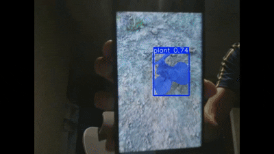

# 🌿 Weed / Plant Instance Segmentation using YOLOv8-seg | Pretrained Instance Segmentation

This repository demonstrates a **real-time weed / plant detection system** using a **pretrained YOLOv8-seg instance segmentation model**.

The model detects weeds (or plants) from a **live webcam feed**, drawing **segmentation masks and bounding boxes**.
No training is required — only the pretrained `best.pt` file is needed.



---

## 🚀 Features

* 🎥 Real-time webcam weed / plant detection
* 🧠 Pretrained YOLOv8-seg **instance segmentation** model
* 🌱 Accurate weed / plant localization with masks + boxes
* ⚡ Fast and lightweight inference
* 🖥️ Simple Windows setup (PowerShell)

---

## 📦 Dataset

Dataset used to train the model:

🔗 Roboflow Dataset:
[https://universe.roboflow.com/mathias-p/weed-detection-535r5-wk5bw](https://universe.roboflow.com/mathias-p/weed-detection-535r5-wk5bw)

---

## 🧰 Tech Stack

* Python 🐍
* YOLOv8-seg (Ultralytics)
* PyTorch
* OpenCV
* NumPy

---

## 📦 Model File

This project uses a pretrained model file:

```
best.pt
```

You only need this file to run inference. (Replace with your weed/plant `best.pt` if you have a custom model.)

---

## 🛠 Requirements

* Windows 10 / 11
* Python **3.11 recommended**
* A webcam

---

## 🐍 Installing Python (IMPORTANT)

⚠️ **Do NOT use Microsoft Store Python**

1. Download Python from:
   [https://www.python.org/downloads/windows/](https://www.python.org/downloads/windows/)

2. Install **Python 3.11 (64-bit)**

3. ✅ Tick **Add Python to PATH**

4. Finish installation and reopen PowerShell

Verify:

```powershell
python --version
```

---

## 🚀 FULL SETUP GUIDE (STEP BY STEP)

### 🔹 Step 1 — Download / Clone the Repository

**Option A — Git**
Clone in Downloads Folder: `cd Downloads`

```powershell
git clone https://github.com/YOUR_USERNAME/YOUR_REPO_NAME.git
```

**Option B — ZIP**

* Click **Code → Download ZIP**
* Extract into **Downloads**

---

### 🔹 Step 2 — Open PowerShell in the Project Folder

```powershell
cd Downloads/test-weed-instance-segmentation-main
```

If there is an extra folder when extracting:

```powershell
cd Downloads/test-weed-instance-segmentation-main/test-weed-instance-segmentation-main
```

Ensure the folder contains:

```
best.pt
run.py
```

---

### 🔹 Step 3 — Install Required Python Packages

```powershell
pip install ultralytics opencv-python numpy
```

Verify:

```powershell
python -c "from ultralytics import YOLO; print('Ultralytics installed')"
```

---

### 🔹 Step 4 — `run.py`

Your `run.py` should contain **exactly**:

```python
from ultralytics import YOLO

# Load pretrained YOLOv8-seg weed/plant instance segmentation model
model = YOLO("best.pt")

# Run real-time webcam inference (source=0 is default webcam)
model.predict(source=0, show=True)
```

> If your model's classes are trained to detect weeds vs crops, the predictions will show class labels and segmentation masks accordingly.

---

### 🔹 Step 5 — Run Weed / Plant Detection

```powershell
python run.py
```

✅ Webcam opens
✅ Weeds / plants are segmented in real time
✅ Press **Q** to quit

---

## 🔧 Troubleshooting

**Webcam not opening**

```python
model.predict(source=1, show=True)
```

**Black screen**

* Close Zoom / Teams / Discord
* Check Windows camera permissions

**Model not found**

* Ensure `best.pt` is in the same folder as `run.py`

---

## 📈 Optional Enhancements

Save output:

```python
model.predict(source=0, show=True, save=True)
```

Adjust confidence threshold:

```python
model.predict(source=0, show=True, conf=0.4)
```

Higher resolution (slower but clearer masks):

```python
model.predict(source=0, show=True, imgsz=960)
```

Run on a video file instead of webcam:

```python
model.predict(source="test_field_video.mp4", show=True, save=True)
```

Filter detections by class (example: only class index 0):

```python
model.predict(source=0, show=True, classes=[0])
```

---

## 📲 Model Export (Optional)

```powershell
yolo export model=best.pt format=onnx
yolo export model=best.pt format=tflite
```

---

## 🧠 Key Takeaways

✔️ `best.pt` contains the entire model
✔️ No training required to run inference (unless you want custom data)
✔️ Works on any compatible Windows PC with a webcam
✔️ Ready for real-world weed / plant instance segmentation and rapid prototyping

